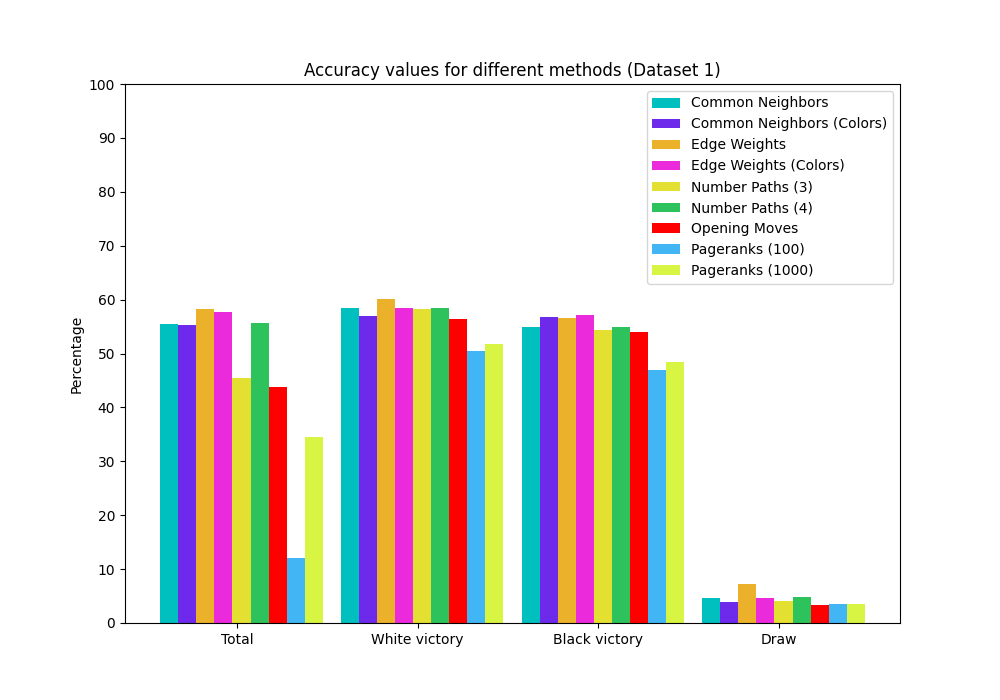
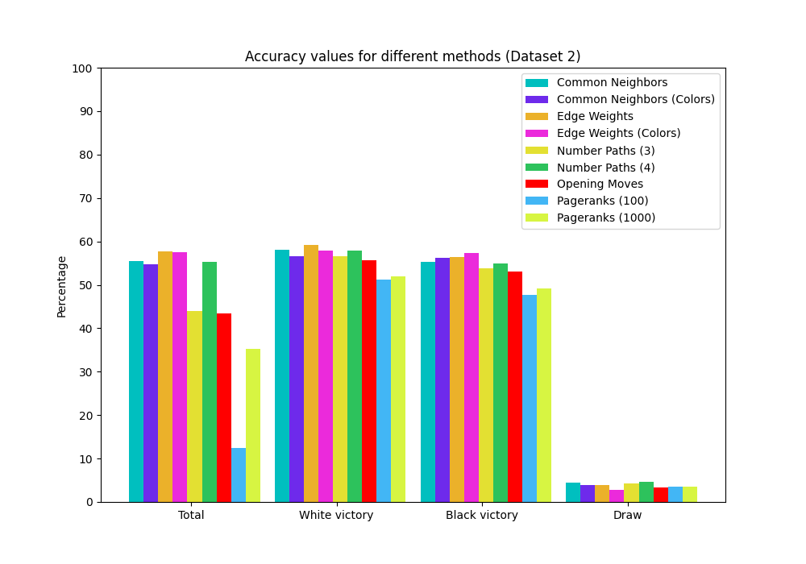
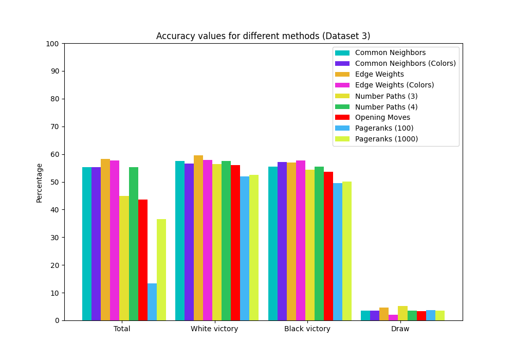

I uploaded the pickled versions of the data I had, but I'm not sure if it's going to work the same in other systems.
If they do not work, the data can be found [here](https://www.ficsgames.org/download.html)

Packages needed to run this code:
- tqdm (for status bar when testing the predictions because I get curious if it is working at all when it takes too long)        
- python-chess (for unpacking/parsing the game data from .pgn files)

### Changes from the update presentation:
Looks like I lied about 70 percent being below average for a 'good' prediction rate. I checked my references again (and also tried actually randomly guessing), and it seems that around 50% is average, and nearing 70% is actually a very good predictor.

And for some reason, pagerank is actually not as good as common neighbors or edge weights(win rates) method. 
So far, a 50/50 (coinflip) perdiction yields ~48% accuracy.

For reference, this is the performance of the coinflip method
|Prediction Method|Dataset 1|Dataset 2|Dataset 3|
|-|-|-|-|
|Coin Flip (50/50)|48.1%|48.05%|47.71%|

### Performances so far
#### Threshold = 1
#### Number of games read in (used 60% as training data) = 100,000
|Prediction Method|Dataset 1|Dataset 2|Dataset 3|
|-|-|-|-|
|Common Neighbors|56.73%|56.23%|56.42%|
|Edge Weights|57.95%|57.62%|57.81%|

#### Threshold = 1
#### Number of games read in (used 60% as training data) = 200,000
|Prediction Method|Dataset 1|Dataset 2|Dataset 3|
|-|-|-|-|
|Common Neighbors|56.71%|56.63%|56.53%|
|Edge Weights|58.3%|57.8%|58.28%|


(threshold of 1 means that it will not skip prediction for that match if there is at least one past record of each player, otherwise it does)
Also, increasing threshold of past records for comm-neighbors and edge weights actually brings down the accuracy, which I assume is from the lack of samples. So I was also mistaken about this in my prior presentation as well.
And of course, seems that increasing the number of training data (although the number of guesses is also going up) does bring up the accuracy.

### Performance of number paths method:
#### Path length is also including the players being evaluated


#### Number of games read in (used 60% as training data) = 100,000
|Path Length threshold|Dataset 1|Dataset 2|Dataset 3|
|:-:|-|-|-|
|3|55.98%|54.73%|55.32%|
|4|58.45%|57.66%|57.72%|

#### Number of games read in (used 60% as training data) = 200,000
|Path Length threshold|Dataset 1|Dataset 2|Dataset 3|
|:-:|-|-|-|
|3|56.36%|55.17%|55.39%|
|4|58.44%|58.17%|%|

**Even at threshold of length 4, each run took over 10 minutes, so it's pretty inefficient, compared to other methods**

For the pagerank algorithm, I changed my implementation a bit so that it would work better for my example (or so I think)
And for a number of given iterations, the algorithm starts with a given source. It will try to visit other nodes that a directed edge takes it until it meets a dead end or the random value generated is less than alpha (currently set to 0.1, this is just to give some more randomness and finish the walks early so it doesn't take forever) 
So it is really a derivative of the 'personalized pagerank' we did in class.
It will do this for a given number of iterations, and each time I evaluate a matchup, I run this for both players, which is probably why this is so slow. In order to avoid doing the calculation for the same player every time, I am storing the value for each player every time I calculate it, so that I can re-use it for recurring players.

My Implementation of a random walk:
```
def random_walk(source,g,num):
    visits = {}
    alpha = 0.1
    for v in g.nodes(): visits[v] = 0
    for i in range(num):

        # we want to use edges because calling 
        # successors returns the multi-edged ones only
        # once, but the edges show all the edges
    
        d = source
        edges = list(g.edges(source))
        while random.random() > alpha and edges:

            # stops either when the random 
            # value is lower than alpha
            # or when there are no more edges to take

            d = random.choice(edges)[1]
            edges = list(g.edges(d))
        visits[d] += 1
    for v in g.nodes(): visits[v] /= num
    return visits
```

### My Pagerank Implementation Performance
 **Since the output for this tends to be more random, I will run these guys multiple times**

### Number of games read in (used 60% as training data) = 100,000

#### Trial 1
|Number of 'Random Walk'|Dataset 1|Dataset 2|Dataset 3|
|-|-:|-:|-:|
|100|48.42%|50.45%|51.12%|
|1000|49.84%|50.42%|51.27%|
|10000|50.26%|50.8%|51.49%|

#### Trial 2
|Number of 'Random Walk'|Dataset 1|Dataset 2|Dataset 3|
|-|-:|-:|-:|
|100|48.37%|49.41%|50.45%|
|1000|49.98%|49.98%|51.1%|
|10000|50.5%|50.98%|51.4%|

#### Trial 3
|Number of 'Random Walk'|Dataset 1|Dataset 2|Dataset 3|
|-|-:|-:|-:|
|100|49.15%|48.63%|49.97%|
|1000|50.18%|50.96%|51.1%|
|10000|50.08%|50.97%|51.51%|

**at iteration=10000, it was taking like an hour or so to complete the tests (so 40000 iterations of future matches), so I'm not sure if it is worth trying anything bigger, although the accuracy does go up as the iteration does**

### Number of games read in (used 60% as training data) = 200,000

#### Trial 1
|Number of 'Random Walk'|Dataset 1|Dataset 2|Dataset 3|
|-|-:|-:|-:|
|100|48.52%|48.07%|51.38%|
|1000|49.67%|50.12%|51.29%|

#### Trial 2
|Number of 'Random Walk'|Dataset 1|Dataset 2|Dataset 3|
|-|-:|-:|-:|
|100|48.66%|49.31%|51.18%|
|1000|49.77%|50.08%|50.95%|

#### Trial 3
|Number of 'Random Walk'|Dataset 1|Dataset 2|Dataset 3|
|-|-:|-:|-:|
|100|49.75%|48.87%|51.09%|
|1000|49.79%|50.05%|51.0%|

**I had to omit iteration=10000 for this test because it was going to take like 10 hours per 1 test**


### Fairness / Goodness Method!
###### This was kind of hard to implement, but at least it performs the best, so all worth it

This method is an implementation of a social network graph's link weight prediction algorithm
It is described [here](https://cs.stanford.edu/~srijan/wsn/) and I used the [slides](https://cs.umd.edu/~srijan/pubs/wsn-icdm2016.pptx) for reference when implementing the code for it.
The idea is that two values, fairness and goodness for each node u,v can be used to predict the weight of a link forming between them.
For an edge going from u to v, the weight is predicted using u_fairness * v_goodness.
Fairness score will be higher for nodes whos outgoing weight to another node accurately represents that destination node's 'goodness'
And the goodness score is calculated by how well 'fair' nodes judge it (weight of the node coming in from such nodes)
Sort of like pageranks, this algorithm takes many iterations to gradually even out the scores for all nodes.
And the victory is predicted by seeing which direction edge will have a greater 'weight'

This is my code for calculating the fairness/goodness scores for a given MultiDiGraph g

```
def calculate_fairgoodness(oldG,threshold):
    import copy
    g = copy.deepcopy(oldG)
    # for this method to work we need back edges (loss edges) 
    # for all edge (which are victory only right now)
    # g is a multidigraph, just like for the pageranks
    data = {}
    for e in g.edges: data[e] = {'weight':0.9}
    nx.set_edge_attributes(g,data)
    toadd = [(e[1],e[0]) for e in g.edges]
    g.add_edges_from(toadd,weight=0.1)
    # now all the original edges in g have weight 1 
    # and the back edges have weight 0
    vals = {}
    # initiating values 
    for v in g.nodes: 
        vals[v] = {}
        vals[v]['f'] = 1
        vals[v]['g'] = 1
    for i in range(threshold):
        for v in g.nodes:
            in_edges = list(set(g.in_edges(v)))
            out_edges = list(set(g.edges(v)))
            fair = []
            good = []
            # Weight of outgoing edge - goodness of that edge being judged            
            for e in out_edges:
                ed = g.get_edge_data(e[0],e[1])
                for k,w in ed.items():
                    fair.append(abs(w['weight']- vals[e[1]]['g']))
            
            # fairness of judging node * weight of the edge from that node
            for e in in_edges:
                ed = g.get_edge_data(e[0],e[1])
                for k,w in ed.items():
                    good.append(vals[e[0]]['f'] * w['weight'])

            vals[v]['f'] = 1 - sum(fair)/(len(fair) * 2)
            vals[v]['g'] = sum(good)/len(good)
    return vals
```
### Number of games read in (used 60% as training data) = 100,000

|Number of Iterations|Dataset 1|Dataset 2|Dataset 3|
|:-:|-:|-:|-:|
|100|57.14%|56.65%|57.27%|
|1000|57.14%|56.65%|57.27%|

### Number of games read in (used 60% as training data) = 200,000

|Number of Iterations|Dataset 1|Dataset 2|Dataset 3|
|:-:|-:|-:|-:|
|100|58.4%|57.92%|58.41%|
|1000|58.4%|57.92%|58.41%|

I stopped after 1000 iterations, because it seemed like the values settled down enough already for 100 iterations.
So now I will try tweaking the values to see if I can make it even better.

For those above results, I gave the victory edges a weight of 0.9 and the back edges for those edges (basically loss edge) a weight of 0.1. This was because if I gave the losing edges a weight of 0, the goodness scores will just sum up to 0 in many cases since whatever fairness the other node has is just multiplied to 0.

Following is the result when I try tweaking these weights (I only did this with the smaller data):

|victory/loss weights|Dataset 1|Dataset 2|Dataset 3|
|:-:|-:|-:|-:|
|0.99/0.01|58.02%|57.83%|57.98%|
|0.8/0.2|58.0%|57.83%|57.99%|
|1/-1|57.86%|57.78%|57.94%|

So I assumed(hoped) that changing the edge weights to 1 and -1 will drastically effect the accuracy, but I guess it just consistently brought it down.
I suspect this is because 0.9 and 0.1 make a much larger difference when being multiplied since the method takes absoulte values anyways.

### Trying to consider the side a player plays from!

#### Number of games read in (used 60% as training data) = 100,000
|Prediction Method|Dataset 1|Dataset 2|Dataset 3|
|-|-:|-:|-:|
|Common Neighbors|56.36%|55.92%|56.23%|
|Edge Weights|56.8%|56.46%|56.89%|

#### Number of games read in (used 60% as training data) = 200,000
|Prediction Method|Dataset 1|Dataset 2|Dataset 3|
|-|-:|-:|-:|
|Common Neighbors|56.89%|56.37%|56.82%|
|Edge Weights|57.81%|57.62%|57.83%|

Boooo values went down! 
So seems that which color the player is playing from is not as important as I thought

### Another Change: 
So far, I have been skipping results where I could have predicted a 'draw'. 
This was because I figured that the chances I get predict a draw correctly is so low that it would be better to just skip that part.
When I skipped, I was not incrementing the number of total guesses I had, so the rates I had so far are essentially rates for getting just the win rate correctly. Now I wanted to see how well I could do for each color, and if there was a difference at all, since the revised common-neighbors and edge-weights methods actually performed worse than before.

For this case, I am only using the bigger datasets (aka read in 200,000 games, and actually has slightly more than 100,000 games)

#### For Dataset 1:
|Prediction Method|Total accuracy rate|White accuracy rate|Black accuracy rate|Draw accuracy rate|
|-|-:|-:|-:|-:|
|Common Neighbors|55.51%|58.43%|54.99%|4.62%|
|Edge Weights|58.24%|60.08%|56.55%|7.27%|
|Number of Paths (3)|45.39%|58.3%|54.42%|4.13%|
|Number of Paths (4)|55.62%|58.5%|54.96%|4.86%|
|PageRanks #1 (100)|11.93%|50.94%|47.23%|3.56%|
|PageRanks #2 (100)|11.93%|48.47%|46.59%|3.56%|
|PageRanks #3 (100)|12.36%|51.71%|47.08%|3.59%|
|PageRanks #1 (1000)|34.68%|51.69%|48.38%|3.55%|
|PageRanks #2 (1000)|34.18%|52.01%|48.52%|3.54%|
|PageRanks #3 (1000)|34.48%|51.66%|48.62%|3.42%|

#### For Dataset 2:
|Prediction Method|Total accuracy rate|White accuracy rate|Black accuracy rate|Draw accuracy rate|
|-|-:|-:|-:|-:|
|Common Neighbors|55.49%|58.0%|55.26%|4.43%|
|Edge Weights|57.73%|59.2%|56.41%|3.92%|
|Number of Paths (3)|44.01%|56.51%|53.83%|4.23%|
|Number of Paths (4)|55.29%|57.93%|54.91%|4.62%|
|PageRanks #1 (100)|12.69%|52.15%|47.97%|3.58%|
|PageRanks #2 (100)|12.26%|49.83%|46.94%|3.51%|
|PageRanks #3 (100)|12.31%|51.88%|47.87%|3.58%|
|PageRanks #1 (1000)|35.36%|51.95%|49.45%|3.4%|
|PageRanks #2 (1000)|35.22%|51.8%|48.93%|3.53%|
|PageRanks #3 (1000)|35.2%|52.02%|49.23%|3.41%|

#### For Dataset 3:
|Prediction Method|Total accuracy rate|White accuracy rate|Black accuracy rate|Draw accuracy rate|
|-|-:|-:|-:|-:|
|Common Neighbors|55.31%|57.55%|55.49%|3.47%|
|Edge Weights|58.22%|59.52%|57.04%|4.65%|
|Number of Paths (3)|44.9%|56.4%|54.4%|5.16%|
|Number of Paths (4)|55.26%|57.52%|55.4%|3.53%|
|PageRanks #1 (100)|13.13%|51.7%|48.55%|3.67%|
|PageRanks #2 (100)|13.58%|52.25%|50.12%|3.72%|
|PageRanks #3 (100)|13.29%|51.78%|50.18%|3.61%|
|PageRanks #1 (1000)|36.75%|52.49%|50.08%|3.4%|
|PageRanks #2 (1000)|36.8%|52.48%|50.21%|3.43%|
|PageRanks #3 (1000)|36.04%|52.34%|49.96%|3.58%|

**Note: Pagerank performance became attrocious!!**

I did not include the data for fairness/goodness because that algorithm actually does not guess draws for any dataset. I think this is because there are too many factors for the values being compared to be equal, which actually ends up making it the most accurate since draws are rare cases.


Since the table is very hard to read, here are the graphs for the accuracy value of each tests.
Each chart represents the values for one dataset.

#### Dataset 1



#### Dataset 2



#### Dataset 3

